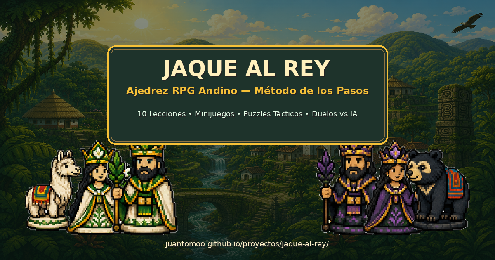

# ♟️ Jaque al Rey — Ajedrez RPG Andino

[](https://juantomoo.github.io/proyectos/jaque-al-rey/)
[](https://juantomoo.github.io/proyectos/jaque-al-rey/)
[-F6C138?style=for-the-badge&logo=javascript)](https://juantomoo.github.io/proyectos/jaque-al-rey/)
[](LICENSE)

> **Un videojuego pedagógico de ajedrez estilo RPG con estética pixel art andina, diseñado para aprender a jugar ajedrez paso a paso, entrenar la visión táctica y desafiar a guardianes ancestrales.**



---

## 🌄 Sinopsis y Ambientación

En las alturas de la cordillera andina, donde la niebla de los páramos acaricia templos ancestrales y bosques de niebla, el ajedrez no es solo un juego de cálculo: es un **ritual sagrado de armonía, estrategia y sabiduría**.

En **Jaque al Rey**, asumes el papel de un **Aprendiz del Valle** guiado por el **Maestro Búho** y los sabios del reino. A través de 10 pasos pedagógicos, minijuegos de agilidad mental, acertijos tácticos y duelos contra guardianes de la selva, desbloquearás mazos de piezas ancestrales, medallas de maestría y terrenos legendarios para convertirte en el legendario **Gran Maestro del Cóndor**.

---

## 🎮 Modos de Juego

El juego cuenta con **6 mundos y modos integrados** accesibles desde la **Mochila de Aventuras (`🎒 MENÚ`)**:

### 1. 📜 Academia (Método de los Pasos)
Currículo interactivo de **10 lecciones progresivas** inspirado en el *Stappenmethode* holandés:
1. **El Tablero y las Coordenadas:** Domina las 64 casillas, columnas (a–h), filas (1–8) y el centro estratégico (`e4`, `d4`, `e5`, `d5`).
2. **El Colibrí Guardián (El Peón):** Vuelo inicial doble, avances simples y capturas diagonales.
3. **La Llama Mágica (El Caballo):** El arte del salto en 'L' por encima de los obstáculos.
4. **La Fortaleza Esmeralda (La Torre):** Dominio de filas, columnas y líneas abiertas.
5. **La Orquídea Sagrada (El Alfil):** Guardianes de las grandes diagonales de luz y sombra.
6. **La Reina y la Coronación:** El máximo poder táctico y la transformación de peones.
7. **El Rey Sabio y la Seguridad:** El corazón del ejército y la regla sagrada de no pisar casillas atacadas.
8. **El Jaque y el Escudo C-I-M:** Las 3 formas de defenderse de una amenaza (*Capturar, Interponer, Mover*).
9. **El Jaque Mate y la Victoria:** Cuando el Rey rival no tiene escapatoria legal.
10. **El Enroque y la Fortaleza:** Protección del monarca y activación de las torres en un solo movimiento.

### 2. ⭐ Minijuegos Neurocognitivos
Entrenamientos tácticos diseñados para desarrollar automatismos y visión espacial:
* **⭐ Planificador de Rutas (Come-Estrellas):** Recolecta todas las estrellas en el menor número de movimientos posibles calculando trayectorias óptimas con caballos, alfiles, torres o reinas.
* **🦙 El Laberinto de la Llama:** Conduce a la Llama Mágica hasta el cofre del tesoro esquivando centinelas con saltos en 'L'.
* **👾 Space Invaders Táctico:** Defiende la base con tu Torre eliminando las oleadas invasoras antes de que crucen el río.
* **🥊 La Lucha de Reyes:** Domina el concepto fundamental del final de partida: la **oposición de reyes** y la conquista de casillas clave en tablero reducido.

### 3. 🧩 Gimnasio de Puzzles Tácticos
Desafíos tácticos reales ordenados por nivel de dificultad con andamiaje de pistas pedagógicas y flechas vectoriales:
* **El Beso de la Reina 👑** (Mate en 1 con apoyo de Alfil)
* **El Mate del Pasillo 🏰** (Castigo a la falta de ventana de escape)
* **El Tenedor de la Llama 🦙** (Ataque doble simultáneo a Rey y Torre)
* **El Mate Árabe 🌙** (Coordinación letal de Caballo y Torre en esquina)
* **La Clavada de la Orquídea 🎯** (Inmovilización absoluta de pieza en diagonal)
* **El Doble Ataque del Colibrí 🐤** (Tenedor de peón a piezas mayores)
* **El Mate de la Coz 💨** (Ataque de caballo asfixiando al rey rodeado)
* **La Batería de Primavera ⚡** (Impacto frontal de Torre y Dama en columna abierta)

### 4. ⚔️ Duelo vs IA (3 Guardianes Ancestrales)
Partidas completas contra tres personalidades con estilos y fuerzas calibradas:
* 🐦 **Pajarito Curioso (Elo ~400):** Nivel principiante, comete imprecisiones amistosas y celebra cada jugada.
* 🐻 **Oso Andino (Elo ~1000):** Nivel intermedio, juego sólido posicional y capturas defensivas.
* 🦅 **Cóndor Real (Elo ~1500):** Nivel avanzado, cálculo minimax con podas, control del centro y remates tácticos implacables.
* *Incluye botón de Deshacer jugada (`↩ DESHACER`) y Consejero Táctico (`🦉 ¿QUÉ HAGO?`).*

### 5. 🎴 Mazos de Fichas & Personalización
Colecciona y equipa sets temáticos de fichas andinas con doble contorno de alto contraste:
* **Blancas:** Reino de la Primavera, Guardianes del Valle, Bosque Dorado, Templo Ancestral.
* **Negras:** Reino de la Noche, Sombras del Volcán, Fauna de Obsidiana, Selva Profunda.
* **Personalizador Individual:** Posibilidad de elegir libremente cada pieza del mazo entre el catálogo de 48+ sprites pixel art.

### 6. 🏆 Salón de Medallas & Rango
Sistema de gamificación basado en los **Cuadernos de Estudio de Artur Yusupov**:
* **Progresión de XP:** Gana puntos de experiencia al completar lecciones, resolver puzzles y ganar partidas.
* **6 Rangos:** Desde *Aprendiz del Valle* 🌱 hasta *Gran Maestro del Cóndor* 👑.
* **10 Medallas de Logro:** Desbloqueables por hazañas específicas.
* **Bitácora de Puntos Ciegos:** Registro automático de errores tácticos para repasarlos y erradicarlos.

---

## 🗺️ Terrenos del Tablero

Personaliza la superficie del tablero con texturas andinas integradas:
* **Preajustes:**
  * 🪨 **Piedra Ancestral:** Muros de piedra tallada incaica.
  * 🌿 **Páramo Andino:** Musgo y pastizales de alta montaña.
  * 🏺 **Arcilla Imperial:** Terracota cocida y adobe ceremonial.
  * ⚡ **Alto Contraste:** Pergamino dorado luminoso y pizarra de obsidiana.
  * 🪵 **Madera & Selva:** Roble ancestral y follaje sombrío.
  * 🌊 **Laguna Sagrada:** Aguas cristalinas y manantiales sagrados.
* **Personalizador Casilla a Casilla:** Combina de forma independiente las casillas claras (☀️) y oscuras (🌙).

---

## 📱 Instalación como PWA (Progressive Web App)

*Jaque al Rey* está optimizado para funcionar como una aplicación nativa en cualquier dispositivo:

* **100% Offline:** Todo el motor de ajedrez, sonidos, gráficos y lecciones se ejecutan localmente en el navegador mediante Service Worker (`sw.js`).
* **Instalable:** 
  * **Android / Chrome:** Pulsa en *"Instalar aplicación"* o *"Agregar a la pantalla principal"*.
  * **iOS / Safari:** Pulsa en el botón *Compartir* y selecciona *"Agregar a inicio"*.
  * **PC / Mac / Linux:** Instálalo como aplicación de escritorio desde la barra de direcciones de Chrome, Edge o Brave.
* **Pantalla Completa:** Experiencia inmersiva sin barras de navegación (`display: standalone`).

---

## 🛠️ Arquitectura y Tecnologías

El proyecto está construido bajo la filosofía de **Zero Dependencias Externas (Vanilla Web)** para garantizar rendimiento, ligereza y longevidad:

```
JaqueAlRey/
├── index.html              # Estructura semántica, Top HUD y modales
├── manifest.webmanifest    # Configuración PWA y badges
├── sw.js                   # Service Worker para caché offline
├── README.md               # Documentación completa del proyecto
├── css/
│   └── styles.css          # Estética pixel art, 9-slice banners, marcos y responsive
├── js/
│   ├── engine.js           # Motor de reglas de ajedrez (FEN, jugadas legales, jaque, mate, enroques)
│   ├── board.js            # Renderizador interactivo del tablero, drag & drop y vectores
│   ├── board_themes.js     # Gestor de terrenos, paletas y casillas independientes
│   ├── pieces.js           # Catálogo de 48+ piezas andinas y asignación de mazos
│   ├── ai.js               # Inteligencia artificial (Minimax, evaluación posicional y coach)
│   ├── academy.js          # Currículo pedagógico del Método de los Pasos (10 Lecciones)
│   ├── minigames.js        # Minijuegos tácticos y cognitivos
│   ├── puzzles.js          # Gimnasio de acertijos tácticos
│   ├── notebook.js         # Cuadernos de estudio, XP, rangos y medallas
│   ├── audio.js            # Motor de audio sintetizado con Web Audio API nativo
│   ├── i18n.js             # Sistema de internacionalización (Español / English)
│   └── app.js              # Controlador principal y ciclo de vida del juego
└── assets/
    ├── backgrounds/        # Fondos ilustrados día y noche (bg_day.png, bg_night.png)
    ├── pieces/             # Sprites pixel art de piezas andinas
    │   └── catalog/        # Catálogo extendido de piezas desbloqueables
    ├── tiles/              # Texturas seamless de piedra, césped, arcilla y madera
    ├── ui/                 # Marcos de madera, esquineros dorados y banners 9-slice
    └── icons/              # Favicons e imágenes de OpenGraph y PWA
```

---

## 🎨 Controles y Accesibilidad

* **Interacción Dual:** Compatible tanto con **Arrastrar y Soltar (Drag & Drop)** como con **Tocar para Mover (Click-to-Move)** con previsualización de casillas legales.
* **Modo Día / Noche:** Alterna la iluminación del fondo entre el día andino y la noche estrellada.
* **Multilingüe:** Selector instantáneo de idioma (🇪🇸 Español / 🇬🇧 English).
* **Audio Sintetizado:** Efectos sonoros procedurales con Web Audio API (sin descargas pesadas de audio).

---

## 🌐 Enlaces y Demo en Vivo

* 🚀 **Jugar en Línea:** [https://juantomoo.github.io/proyectos/jaque-al-rey/](https://juantomoo.github.io/proyectos/jaque-al-rey/)
* 🎨 **Portafolio de Proyectos:** [https://juantomoo.github.io/](https://juantomoo.github.io/)

---

## 📄 Licencia

Este proyecto está bajo la Licencia **MIT**. Desarrollado con 💚 y pasión por el ajedrez pedagógico por **Juan Tomoo**.
